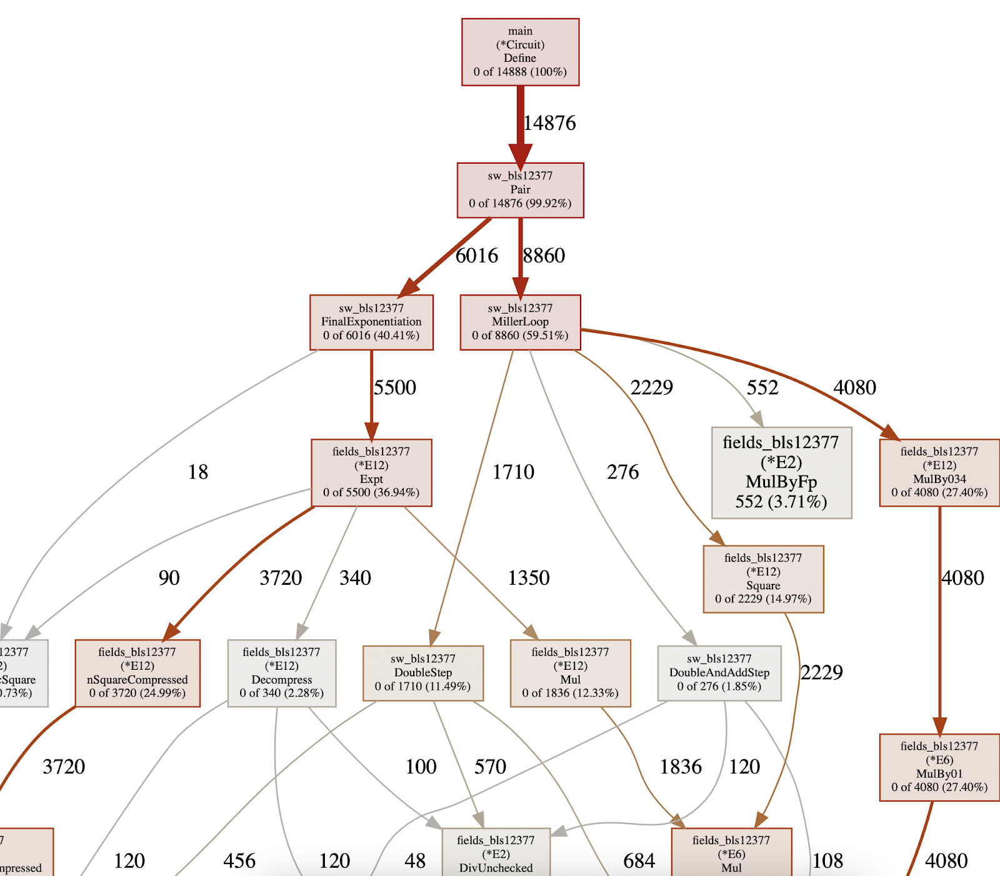
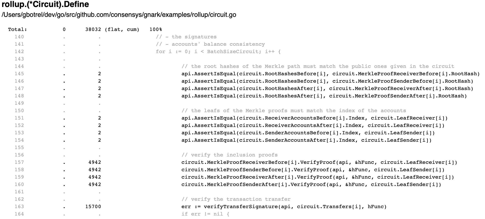

# Profile circuits

In the [Performance](write/design_considerations#performance) we emphasize the importance of minimizing the number of constraints.

`gnark/profile` is a profiling package, which creates `pprof` compatible profiling files. Once the `.pprof` file is generated, one can visualize it using `go tool pprof` like standard Golang CPU or Memory profiles.

A `gnark` `Profile` measures the number of constraint added in a circuit.

## Usage

```go
type Circuit struct {
	A frontend.Variable
}

func (circuit *Circuit) Define(api frontend.API) error {
	api.AssertIsEqual(api.Mul(circuit.A, circuit.A), circuit.A)
	return nil
}

func Example() {
	// default options generate gnark.pprof in current dir
	// use pprof as usual (go tool pprof -http=:8080 gnark.pprof) to read the profile file
	// overlapping profiles are allowed (define profiles inside Define or subfunction to profile
	// part of the circuit only)
	p := profile.Start()
	_, _ = frontend.Compile(ecc.BN254.ScalarField(), r1cs.NewBuilder, &Circuit{})
	p.Stop()

	fmt.Println(p.NbConstraints())
	fmt.Println(p.Top())
	// Output:
	// 2
	// Showing nodes accounting for 2, 100% of 2 total
	//       flat  flat%   sum%        cum   cum%
	//          1 50.00% 50.00%          2   100%  profile_test.(*Circuit).Define profile/profile_test.go:17
	//          1 50.00%   100%          1 50.00%  r1cs.(*r1cs).AssertIsEqual frontend/cs/r1cs/api_assertions.go:37
}
```

### Example `pprof` constraint graph for a Pairing-check circuit



### Example `pprof` source code mapping for `example/rollup` circuit

With fine granularity, we identify the number of constraints generated by each line of code:


