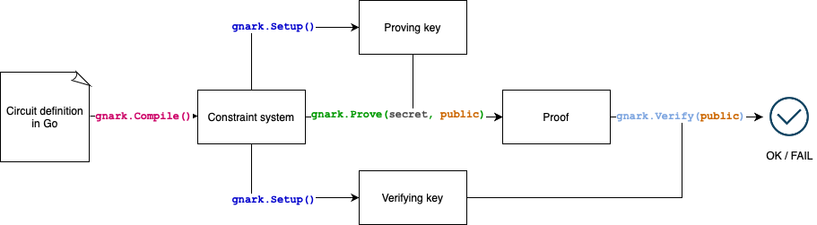
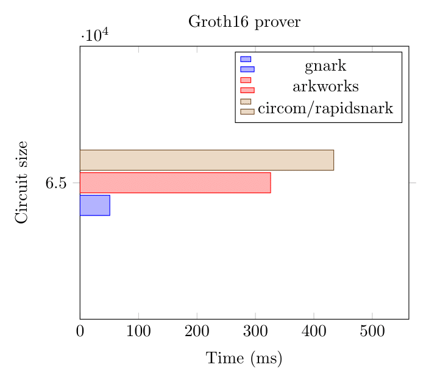
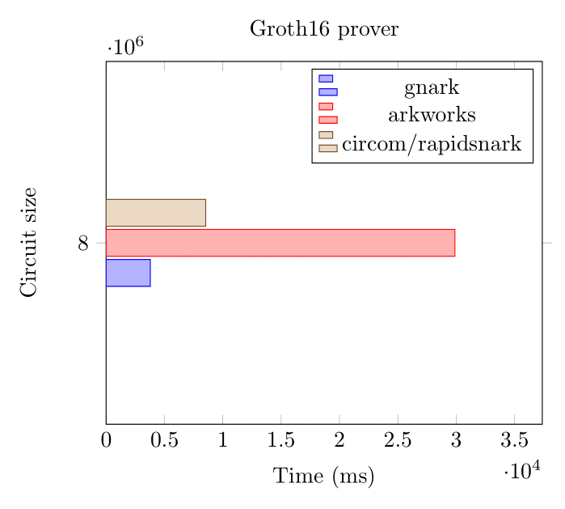
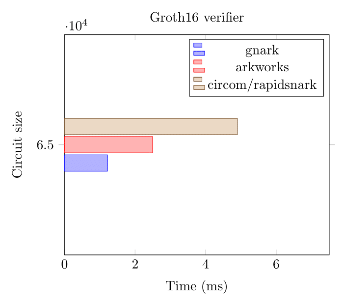

# gnark

## What's `gnark`?

`gnark` is a fast [zk-SNARK] library that offers a [high-level API] to design [circuits]. The library is open source and developed under the Apache 2.0 license

### How does `gnark` work?

In a typical workflow:

1. [Implement an algorithm] for which you want to prove and verify execution.
1. Use the `gnark/frontend` package to [translate the algorithm into a set of mathematical constraints].
1. Use the `gnark/backend` package to [create and verify your **proof of knowledge**](HowTo/prove.md). That is, you prove that you know a list of **secret inputs** satisfying a set of mathematical constraints.



:::warning

`gnark` has been [partially audited](https://github.com/ConsenSys/gnark-crypto/blob/master/audit_oct2022.pdf) and is provided as-is, use at your own risk.

In particular, `gnark` makes no security guarantees such as constant time implementation or side-channel attack resistance.

:::

### `gnark` circuits are written in Go

Users write their zk-SNARK circuits in plain Go. `gnark` uses Go because:

- Go is a mature and widely used language with a robust tool chain.
- Developers can **debug**, **document**, **test** and **benchmark** circuits as they would with any other Go program.
- Circuits can be versioned, unit-tested and used in standard continuous integration and delivery (CI/CD) workflows.
- IDE integration.

`gnark` exposes its APIs like any conventional cryptographic library. Complex solutions need API flexibility. For example gRPC and REST APIs, serialization protocols, monitoring, and logging can be easily added.

:::info Example of how to prove knowledge of a pre-image

<!--tabs-->

# 1. define circuit

```go
// Circuit defines a pre-image knowledge proof
// mimc(secret preImage) = public hash
type Circuit struct {
    PreImage frontend.Variable
    Hash     frontend.Variable `gnark:",public"`
}

// Define declares the circuit's constraints
func (circuit *Circuit) Define(api frontend.API) error {
    // hash function
    mimc, err := mimc.NewMiMC(api.Curve())

    // specify constraints
    // mimc(preImage) == hash
    api.AssertIsEqual(circuit.Hash, mimc.Hash(cs, circuit.PreImage))

    return nil
}
```

# 2. compile circuit

```go
var mimcCircuit Circuit
r1cs, err := frontend.Compile(ecc.BN254, r1cs.NewBuilder, &mimcCircuit)
```

# 3. create proof

```go
// witness
assignment := &Circuit{
    Hash: "16130099170765464552823636852555369511329944820189892919423002775646948828469",
    PreImage: 35,
}
witness, _ := frontend.NewWitness(assignment, ecc.BN254.ScalarField())
publicWitness, _ := witness.Public()
pk, vk, err := groth16.Setup(r1cs)
proof, err := groth16.Prove(r1cs, pk, witness)
err := groth16.Verify(proof, vk, publicWitness)
```

# 4. unit test

```go
assert := groth16.NewAssert(t)

var mimcCircuit Circuit

{
    assert.ProverFailed(&mimcCircuit, &Circuit{
        Hash: 42,
        PreImage: 42,
    })
}

{
      assert.ProverSucceeded(&mimcCircuit, &Circuit{
        Hash: "16130099170765464552823636852555369511329944820189892919423002775646948828469",
        PreImage: 35,
    })
}

```

<!--/tabs-->

:::

### `gnark` is fast

:::info

- `gnark` won the [ZPrize competition to accelerate MSM on Mobile](https://mirror.xyz/ocelotlabs.eth/QytYZQIaiA73abHeUj8NS0Mm5_f0fMptrZM70DvmeMc) 🎉
- [zka.lc](https://zka.lc/charts) shows gnark performs better than `arkworks` or `supranational/blst` for most operations

:::

:::note

It is difficult to fairly and accurately compare benchmarks among libraries. Some implementations may excel in conditions where others may not. Results depend on target or available instruction set, CPUs and RAM.

:::

On low-level primitives like the pairing or the field multiplication, [gnark-crypto](https://github.com/ConsenSys/gnark-crypto) outperforms most libraries out there. It translates well up-the-stack - `gnark` compiles gigantic circuits in seconds, and its solver (aka witness generation) and provers perform very well on most architectures.

Here we benchmark two circuits (65k and 8M constraints) using `gnark`, `arkworks` and `rapidsnark` on the BN254 curve.

#### Groth16 Prover (BN254, 65k constraints)



#### Groth16 Prover (BN254, 8 million constraints)



On large circuits, that's **over 2 million constraints per second**.

#### Groth16 Verifier (BN254)



:::note

These benchmarks were executed on an AWS `hpc6a` instance in November 2022.

:::

## Proving schemes and curves

Refer to the [Proving schemes and curves](Concepts/schemes_curves.md) section.

<!--links-->

[zk-SNARK]: Concepts/zkp.md
[high-level API]: HowTo/write/circuit_api.md
[circuits]: Concepts/circuits.md
[Implement an algorithm]: HowTo/write/circuit_api.md
[translate the algorithm into a set of mathematical constraints]: HowTo/compile.md
